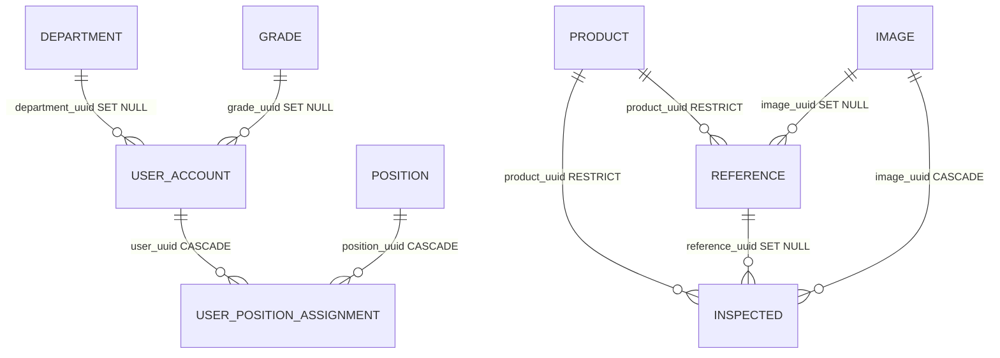

# Database Relationships

## 관계도

## 외래키 목록

| 출발 필드 | 참조 | 삭제 정책 | 설계 의도 |
|---|---|---|---|
| `USER_ACCOUNT.department_uuid` | `DEPARTMENT.uuid` | `ON DELETE SET NULL` | 부서가 삭제되어도 사용자 계정은 유지 |
| `USER_ACCOUNT.grade_uuid` | `GRADE.uuid` | `ON DELETE SET NULL` | 직급이 삭제되어도 사용자 계정은 유지 |
| `USER_POSITION_ASSIGNMENT.user_uuid` | `USER_ACCOUNT.uuid` | `ON DELETE CASCADE` | 사용자 삭제 시 직책 배정도 삭제 |
| `USER_POSITION_ASSIGNMENT.position_uuid` | `POSITION.uuid` | `ON DELETE CASCADE` | 직책 삭제 시 직책 배정도 삭제 |
| `REFERENCE.product_uuid` | `PRODUCT.uuid` | `ON DELETE RESTRICT` | 대조군이 남아 있으면 제품 삭제 금지 |
| `REFERENCE.image_uuid` | `IMAGE.uuid` | `ON DELETE SET NULL` | 이미지 레코드가 없어져도 대조군 정보는 유지 |
| `INSPECTED.product_uuid` | `PRODUCT.uuid` | `ON DELETE RESTRICT` | 검사 이력이 남아 있으면 제품 삭제 금지 |
| `INSPECTED.reference_uuid` | `REFERENCE.uuid` | `ON DELETE SET NULL` | 대조군 삭제 후에도 검사 이력은 유지 |
| `INSPECTED.image_uuid` | `IMAGE.uuid` | `ON DELETE CASCADE` | 검사 대상 이미지 삭제 시 검사 이력도 삭제 |

## 삭제 흐름

제품 삭제는 `REFERENCE`와 `INSPECTED`가 `PRODUCT.uuid`를 `RESTRICT`로 참조하므로 바로 수행하지 않는다.

1. 실제 이미지 파일 삭제 정책을 먼저 결정한다.
2. 관련 `IMAGE` 레코드를 삭제한다.
3. 관련 `REFERENCE` 또는 `INSPECTED` 레코드 정리를 수행한다.
4. 참조 레코드가 없어졌을 때 `PRODUCT` 레코드를 삭제한다.

## 로그/스냅샷 예외

`LLM_USAGE`는 원본 설계서에서 "LOG 이므로, 타 테이블을 참조하지 않고 고정된 값을 가짐"으로 정의되어 있다.

- `llm_name`, `llm_provider`, `llm_model`은 `LLM`의 현재 FK가 아니라 사용 시점의 스냅샷 값이다.
- `user_account_name`, `user_account_uuid`도 `USER_ACCOUNT` FK가 아니라 사용 시점의 스냅샷 값이다.
- 사용자 삭제, LLM 설정 변경 이후에도 과거 사용 로그는 원본 값을 유지한다.

## 특이 관계

- `DEPARTMENT.parent_uuid`는 상급부서 UUID로 설명되어 있으나 원본 설계서에는 self-FK가 명시되어 있지 않다.
- `INSPECTION_SESSION.uuid`는 여러 촬영 결과를 하나의 검사 묶음으로 연결하는 UUID다.
- `INSPECTED.inspection_session_uuid`는 `INSPECTION_SESSION.uuid`를 참조한다.
- API에서는 이 값을 `inspectionSessionUuid`로 노출한다.
- `DEPARTMENT(parent_uuid, name)`, `USER_POSITION_ASSIGNMENT(user_uuid, position_uuid)`, `REFERENCE(product_uuid, step_order)`, `INSPECTED(session, product_uuid, reference_uuid, round)`는 `COMPOSITE`로 표시되어 있으나 실제 unique constraint 이름과 null 처리 정책은 별도 확정이 필요하다.
