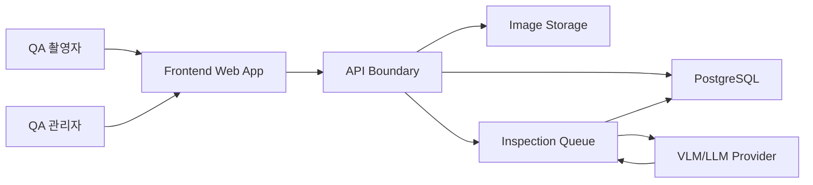

# System Design

## 설계 결론

1차 제품은 "사진 기반 QA 판정 보조 웹앱"으로 설계한다.

목표는 자동 최종 보증이 아니라 다음 세 가지다.

- 촬영 표준화
- 기준 사진과 QA 대상 사진의 비교 근거 생성
- 검사 이력과 촬영자 책임 추적

도면 기반 치수/공차 판정은 계측 장비 없이 보증하지 않는다.

## 앱 형태

우선 웹앱으로 설계한다.

선택 근거:

- 사내용 시스템은 배포/업데이트가 빠른 웹앱이 유리하다.
- 카메라 촬영은 브라우저 `getUserMedia` 기반으로 1차 구현이 가능하다.
- 태블릿/현장 PC에서 같은 흐름을 제공할 수 있다.
- 향후 카메라 제어, 산업용 장비 연동, 오프라인 촬영 저장이 필요해지면 앱 래퍼 또는 네이티브 앱으로 확장한다.

## 대상 장비 제약

고객 사용 장비는 `M86XE` 계열 태블릿이다.

현재 설계는 태블릿 촬영 UX를 기준으로 하며, 정확한 OS/브라우저/카메라 사양은 실기 또는 고객 제공 사양서로 확인한다. 세부 확인 항목은 [device-constraints.md](device-constraints.md)를 따른다.

## 큰 구조

## 주요 책임

| 영역 | 책임 |
|---|---|
| Frontend | 로그인, 제품 선택, 기준 사진 등록, 단계형 QA 촬영, 진행 상태, 최종 결과 표시 |
| API Boundary | 프론트가 직접 DB/LLM/storage를 알지 않게 하는 계약 계층 |
| Image Storage | 기준 사진, QA 대상 사진, 썸네일, 오버레이 원본/파생물 보관 |
| PostgreSQL | 제품, 기준 사진, 검사 이력, 사용자, LLM 사용 로그 보관 |
| Inspection Queue | 촬영 직후 비교 작업 예약, retry, 실패 원인 관리 |
| VLM/LLM Provider | 기준 사진과 QA 대상 사진 비교, 구조화된 결과 반환 |

## 기능 분해

상세 기능 경계는 [functional-decomposition.md](functional-decomposition.md)를 기준으로 한다.

1차 기능은 Auth, Product Catalog, Reference Registration, Reference Guide, Inspection Session, Capture Step, Comparison Job, Result Aggregation, Inspection History, Admin Config로 나눈다.

각 기능은 책임, 입력, 출력, 실패 상태, 의존성을 문서화한다.

## 의존성 주입

의존성 주입과 패턴 사용 기준은 [dependency-injection-and-patterns.md](dependency-injection-and-patterns.md)를 따른다.

- 기능 코드는 interface에 의존한다.
- HTTP, mock, storage, VLM provider, repository, clock, uuid generator는 주입받는다.
- 전역 mutable state와 singleton service locator는 만들지 않는다.
- Factory/Adapter/Strategy/Repository/Unit of Work/State Machine은 필요할 때 적극적으로 사용한다.

## 사용자 역할

| 역할 | 가능 작업 |
|---|---|
| QA 촬영자 | 로그인, 제품 선택, QA 대상 촬영, 최종 결과 확인 |
| QA 관리자 | 기준 사진 등록/수정, 검사 이력 확인, 검토 필요 항목 판정 |
| 시스템 관리자 | 사용자/권한/LLM/API 설정 관리 |

## 핵심 도메인

| 개념 | 설명 | DB 기준 |
|---|---|---|
| Product | QA 대상 제품 | `PRODUCT` |
| Reference Shot | 제품별 기준 대조군 사진과 촬영 순서 | `REFERENCE`, `IMAGE` |
| Inspection Session | 한 제품에 대해 한 번 수행하는 전체 QA 촬영 묶음 | `INSPECTION_SESSION` |
| Inspection Shot | 기준 사진 하나에 대응하는 QA 대상 촬영 결과 | `INSPECTED`, `IMAGE` |
| Comparison Result | VLM/LLM 비교 결과와 근거 | `INSPECTED`, `LLM_USAGE` |

## 검사 세션 설계

QA 촬영은 여러 기준 사진에 대응하는 여러 장의 QA 대상 사진을 한 번의 검사로 묶어야 한다.

최신 DB 설계는 `INSPECTION_SESSION` 테이블을 추가해 "이번 검사에서 촬영한 N장"을 묶을 수 있게 되었다.

현재 판단:

- API에서는 `INSPECTION_SESSION.uuid`를 `inspectionSessionUuid`로 노출한다.
- `INSPECTED.inspection_session_uuid`는 `INSPECTION_SESSION.uuid`를 참조한다.
- 세션 상태, 차수, 제품 연결은 `INSPECTION_SESSION`이 책임진다.
- 개별 촬영자와 기준 사진별 QA 대상 이미지는 `INSPECTED`가 책임진다.

남은 확인 사항은 `session` 생성 주체, 복합 unique 범위, nullable/default 정책이다.

## 처리 전략

VLM 처리는 "촬영 직후 백그라운드 개별 처리 + 전체 촬영 완료 후 최종 집계"로 설계한다.

이유:

- 촬영 시간 동안 모델 처리 시간을 숨길 수 있다.
- 촬영자가 개별 결과에 흔들리지 않고 작업 순서를 끝낼 수 있다.
- 실패한 개별 비교만 재시도할 수 있다.
- 최종 결과는 전체 촬영 세트가 갖춰진 뒤 일관되게 계산한다.

## 판정 원칙

- `passed`: 전체 기준을 만족한다고 볼 수 있음
- `rejected`: 명확한 차이/누락/오조립/외관 이상이 있음
- `needs_review`: 모델 확신이 낮거나 사람이 확인해야 함
- `failed`: 처리 실패이며 합격/불합격이 아님

`failed`와 `needs_review`를 `passed`나 `rejected`로 폴백하지 않는다.

## 1차 구현 우선순위

1. 프론트 화면 흐름과 API 계약 고정
2. mock adapter와 fixture 분리
3. 기준 사진 등록 화면
4. 단계형 QA 촬영 화면
5. 최종 결과 화면
6. 백엔드 API/DB 마이그레이션 설계
7. 실제 이미지 저장/VLM 연동

## 비목표

- 일반 사진만으로 도면 치수/공차 보증
- 사람이 확인할 수 없는 자동 최종 보증
- 백엔드 없는 상태에서 프론트가 비즈니스 값을 생성하는 구현
- 실패를 성공처럼 숨기는 폴백
