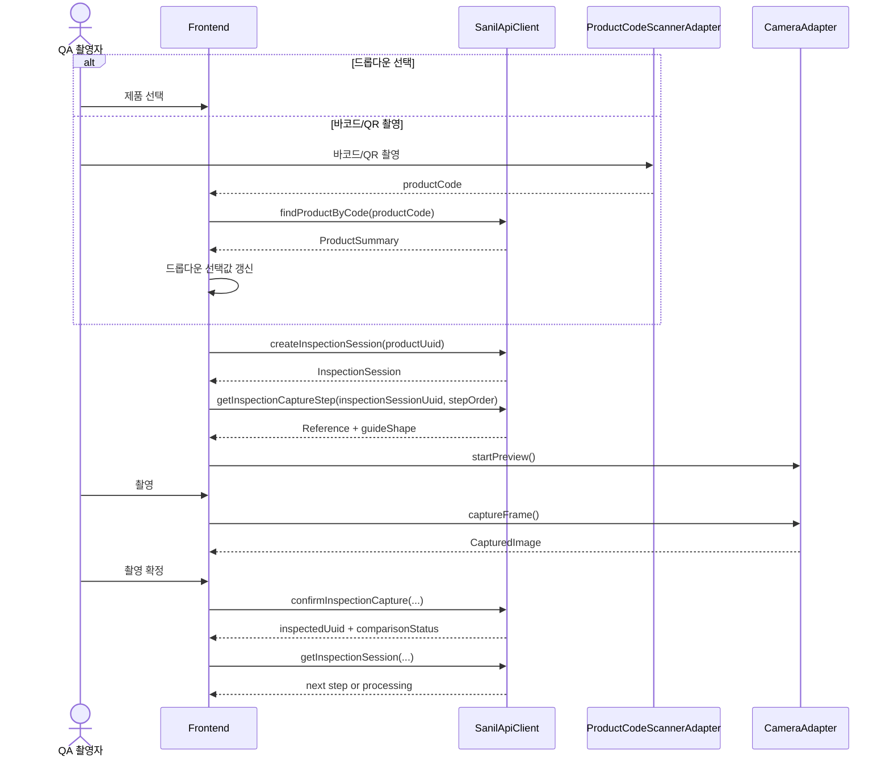

# Frontend Design

## 결론

프론트엔드는 `M86XE` 태블릿 현장 촬영을 우선하는 React + TypeScript 웹앱으로 설계한다.

1차 목표는 빠른 화면 구현이 아니라 다음 경계를 안정화하는 것이다.

- 화면과 API 계약 분리
- API와 mock 구현 분리
- 촬영 장치 제어와 화면 상태 분리
- 검사 세션, 촬영 단계, 최종 결과의 상태 전이 명확화
- 기준 이미지 가이드 좌표와 VLM 결과 좌표의 동일 계약 사용

## 기술 선택

| 항목 | 선택 | 이유 |
|---|---|---|
| App runtime | Vite + React + TypeScript | 태블릿 웹앱 구현 속도와 타입 안정성 |
| Routing | React Router | 검사 세션과 촬영 단계 URL 표현 |
| Server state | TanStack Query | API 상태, 재요청, 캐시, loading/error 분리 |
| Local UI state | React state/reducer | 촬영 프리뷰, 버튼 상태, 오버레이 표시 등 화면 내부 상태에 한정 |
| Styling | CSS Modules 또는 scoped CSS | 초기 구현에서 스타일 책임을 컴포넌트 단위로 유지 |
| Camera | injected `CameraAdapter` | 브라우저 `getUserMedia`와 향후 앱 래퍼/네이티브 제어 분리 |
| Product scan | injected `ProductCodeScannerAdapter` | 바코드/QR 촬영과 제품 코드 디코딩을 제품 화면에서 분리 |
| Mock | `src/api` 뒤의 mock adapter + fixture | 화면/훅/컴포넌트에 mock 데이터 유입 방지 |

전역 mutable store는 기본 선택지로 쓰지 않는다. 여러 route에서 공유해야 하는 값은 URL, API, query cache, 명시적 provider 중 하나로 소유권을 정한다.

## MVP 화면 흐름

1. 로그인
2. 제품 선택: 드롭다운 선택 또는 바코드/QR 촬영으로 드롭다운 선택값 갱신
3. 제품별 기준 사진 목록
4. 기준 사진 등록/수정
5. 기준 사진 가이드 shape 확인/편집
6. 검사 세션 시작
7. 단계형 QA 대상 촬영
8. 전체 촬영 완료 후 처리 상태 대기
9. 최종 결과 확인
10. 검사 이력 조회

최종 합부 결과는 모든 필수 촬영이 끝난 뒤에만 표시한다. 개별 촬영 직후에는 처리 상태만 보여주고 개별 합부 판정은 숨긴다.

## Route 설계

| Route | 화면 | 주요 데이터 |
|---|---|---|
| `/login` | 로그인 | auth |
| `/products` | 제품 선택 | `ProductSummary[]`, scanned product code |
| `/products/:productUuid/references` | 기준 사진 목록 조회 | `ReferenceShot[]` |
| `/admin/references` | 관리자 기준 사진 등록/관리 | product, image upload |
| 후속 | 가이드 shape 편집 | `ReferenceGuideShape` |
| `/inspections/new?productUuid=` | 검사 시작 | product, references |
| `/inspections/:inspectionSessionUuid/capture/:stepOrder` | 단계형 촬영 | session, step, camera |
| `/inspections/:inspectionSessionUuid/processing` | 처리 상태 대기 | session, comparison statuses |
| `/inspections/:inspectionSessionUuid/result` | 최종 결과 | final result |
| `/inspections/history` | 검사 이력 | session summaries |

URL의 세션 식별자는 `inspectionSessionUuid`로 쓴다. DB 기준은 `INSPECTION_SESSION.uuid`다.

## M86XE Layout 기준

- 1차 기준 viewport는 8 inch, 1280 x 800, 16:10 landscape다.
- 해당 범위에서는 데스크톱형 좌측 사이드바 대신 상단 메뉴 버튼과 drawer navigation을 사용한다.
- 제품 선택 화면은 드롭다운을 단일 선택 상태로 두고, 바코드/QR 촬영 성공 시 해당 제품을 드롭다운에 반영한다.
- 제품 선택 화면에는 제품 카드 목록을 두지 않는다.
- 검사 시작 액션은 선택 패널에 모아 오조작을 줄인다.
- 촬영 화면은 preview 영역을 최우선으로 두고, 기준 썸네일과 촬영 확정 버튼은 오른쪽 작업 패널에 둔다.
- 주요 입력과 버튼은 최소 48px 터치 높이를 기준으로 한다.

## Feature 경계

| Feature | 책임 | 수정 금지 경계 |
|---|---|---|
| `admin` | 기준 사진 등록/관리 등 관리자 작업 | 검사 세션 생성, QA 대상 촬영 |
| `auth` | 로그인, 현재 사용자 확인, 권한 표시 | 제품/검사 비즈니스 판단 |
| `products` | 제품 목록, 드롭다운 선택, 바코드/QR 촬영 결과 반영 | 기준 사진 데이터 생성 |
| `references` | 작업자용 기준 사진 목록 조회와 guide 표시 | 기준 사진 생성/수정 |
| `reference-guide` | `guideShape` 표시/편집 | VLM 판정 결과 생성 |
| `inspection-session` | 검사 세션 생성, 전체 진행 상태 조회 | 카메라 제어 |
| `inspection-capture` | 한 단계 촬영, 재촬영, 확정 | 최종 합부 결과 표시 |
| `inspection-processing` | 전체 처리 대기, 실패 상태 표시 | 개별 판정 노출 |
| `inspection-result` | 최종 결과와 근거 표시 | 결과 임의 생성/보정 |
| `inspection-history` | 완료/실패/폐기된 검사 이력 조회 | 검사 데이터 수정 |

## 데이터 흐름



## 촬영 상태 모델

| 상태 | 의미 | 허용 액션 |
|---|---|---|
| `camera_permission_required` | 카메라 권한 필요 | 권한 요청 |
| `camera_ready` | 프리뷰 가능 | 촬영 |
| `captured_unconfirmed` | 촬영했지만 확정 전 | 재촬영, 확정 |
| `confirming` | 이미지 저장/확정 요청 중 | 취소 불가, 중복 요청 금지 |
| `confirmed_queued` | 확정 완료, 비교 대기 | 다음 단계 |
| `confirmed_processing` | 확정 완료, 비교 처리 중 | 다음 단계 |
| `confirm_failed` | 이미지 저장 또는 확정 실패 | 재시도, 재촬영 |

이 상태는 UI 내부 상태다. 합격/불합격 판정 상태와 섞지 않는다.

## 좌표 계약

기준 이미지 guide shape와 VLM 결과 좌표는 같은 좌표 계약을 사용한다.

```ts
export interface RatioCoordinateContract {
  origin: "top_left";
  unit: "ratio";
}
```

- 좌상단은 `(0, 0)`이다.
- 우하단은 `(1, 1)`이다.
- `x`, `y`, `w`, `h`는 모두 0 이상 1 이하 비율이다.
- `IMAGE.width`, `IMAGE.height`는 렌더링, 검증, 디버깅용 메타데이터로만 쓰고 좌표 저장 기준으로 쓰지 않는다.

## Mock 원칙

- mock 데이터는 컴포넌트, hook, page 파일에 넣지 않는다.
- mock adapter는 `SanilApiClient` interface를 구현한다.
- fixture는 `src/api/mock/fixtures/` 아래 JSON 또는 TS data module로 분리한다.
- 백엔드가 제공하지 않은 비즈니스 값을 mock adapter가 임의로 만들어 정상 계약처럼 숨기지 않는다.
- API 계약이 비어 있으면 화면은 빈 상태 또는 명시적 오류 상태를 보여준다.

## 실기 확인 항목

`M86XE` 태블릿에서 구현 전 PoC로 확인할 항목:

- Chrome 또는 기본 브라우저에서 `getUserMedia` 후면 카메라 접근 가능 여부
- 실제 viewport 크기와 portrait/landscape 전환
- 사진 캡처 해상도와 업로드 가능한 파일 크기
- 조명 조건에서 overlay 가시성
- 권한 거부/브라우저 새로고침/네트워크 끊김 처리

## 미확정 항목

- `INSPECTED.result`의 DB 저장 형식이 단일 finding 객체인지, finding 배열인지 API 계약에서 확정해야 한다.
- 관리자 기준 사진 등록 화면에서 guide shape를 수동 편집할지, 1차에서는 업로드된 shape만 표시할지 결정해야 한다.
- 오프라인 촬영 저장은 MVP 범위에서 제외한다. 필요하면 앱 래퍼 또는 별도 sync 설계가 필요하다.
